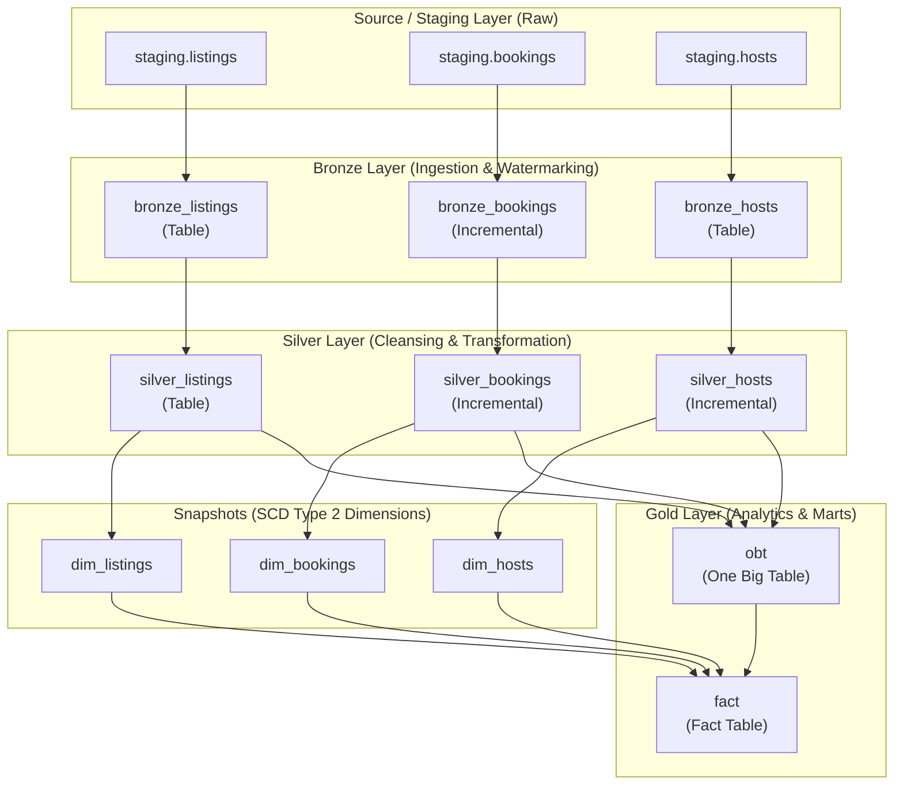

# Airbnb Data Platform — dbt & Snowflake

An end-to-end data transformation pipeline built using **dbt Core** and **Snowflake**, following the **Medallion Architecture** (Bronze &rarr; Silver &rarr; Gold) and implementing **SCD Type 2 Snapshots**.

---

## 🏗️ Architecture Overview



---

## 📁 Repository Structure

```text
DBT_Snowflake/
├── README.md                      # Project documentation
├── pyproject.toml                 # Project metadata & dependencies
├── requirements.txt               # Pinned Python package dependencies
├── .gitignore                     # Git ignore rules
└── dbt_snowflake/                 # Main dbt project folder
    ├── dbt_project.yml            # dbt configurations and schema mapping
    ├── analyses/                  # Ad-hoc analysis queries
    ├── macros/                    # Reusable Jinja macros
    │   ├── generate_schema_name.sql  # Custom schema routing
    │   ├── multiply.sql           # Rounded multiplication calculation
    │   ├── tag.sql                # SQL CASE price-tag categorization
    │   └── trimmer.sql            # String cleaning & normalization
    ├── models/
    │   ├── sources/
    │   │   └── sources.yml        # Raw staging data source declarations
    │   ├── bronze/                # Ingestion models (tables & incremental)
    │   │   ├── bronze_bookings.sql
    │   │   ├── bronze_hosts.sql
    │   │   ├── bronze_listings.sql
    │   │   └── properties.yml
    │   ├── silver/                # Cleaned & transformed business entities
    │   │   ├── silver_bookings.sql
    │   │   ├── silver_hosts.sql
    │   │   └── silver_listings.sql
    │   └── gold/                  # Analytical models
    │       ├── ephemeral/         # Inlined CTE staging models
    │       │   ├── bookings.sql
    │       │   ├── hosts.sql
    │       │   └── listings.sql
    │       ├── obt.sql            # One Big Table with dynamic Jinja joins
    │       └── fact.sql           # Fact table referencing dimensions & OBT
    └── snapshots/                 # SCD Type 2 dimension snapshots
        ├── dim_bookings.yml
        ├── dim_hosts.yml
        └── dim_listings.yml
```

---

## 🚀 Setup & Installation

### 1. Prerequisites
- **Python 3.12**
- **[uv](https://docs.astral.sh/uv/)** or `pip`
- **Snowflake Account** with permissions on target database (`AIRBNB`)

### 2. Environment Setup
Clone the repository and set up a virtual environment:

```bash
git clone git@github.com:dhirajrm/DBT_Snowflake.git
cd DBT_Snowflake

# Create virtual environment with Python 3.12
uv venv --python 3.12
source .venv/bin/activate

# Install dependencies
uv pip install -r requirements.txt
```

### 3. Snowflake Authentication (Key-Pair Authentication)
This project uses **RSA Key-Pair authentication** to bypass MFA for programmatic pipelines.

1. Verify your private key is located at `~/.dbt/keys/rsa_key.p8`.
2. Configure your profile in `~/.dbt/profiles.yml` (or `dbt_snowflake/profiles.yml`):

```yaml
dbt_snowflake:
  outputs:
    dev:
      type: snowflake
      account: <YOUR_ACCOUNT_LOCATOR>
      user: <YOUR_USERNAME>
      role: ACCOUNTADMIN
      database: AIRBNB
      warehouse: COMPUTE_WH
      schema: DBT_SCHEMA
      threads: 4
      private_key_path: /Users/<your_user>/.dbt/keys/rsa_key.p8
  target: dev
```

---

## ⚡ Running the Pipeline

Navigate to the dbt project folder:

```bash
cd dbt_snowflake
```

### Validate Snowflake Connection
```bash
dbt debug
```

### Run All Models
```bash
dbt run
```

### Run by Medallion Layer
```bash
dbt run --select models/bronze    # Run Bronze ingestion models
dbt run --select models/silver    # Run Silver transformed models
dbt run --select models/gold      # Run Gold analytical models
```

### Run SCD Type 2 Snapshots
```bash
dbt snapshot
```

### Full Project Build (Models + Snapshots + Tests)
```bash
dbt build
```

---

## 🧩 Key Features & Implementation Highlights

- **Medallion Schema Organization**: Automated routing of models into custom schemas (`AIRBNB.BRONZE`, `AIRBNB.SILVER`, `AIRBNB.GOLD`) using a custom `generate_schema_name` macro.
- **Incremental Loading**: Implemented on high-volume tables (`bronze_bookings`, `silver_bookings`, `silver_hosts`) with `is_incremental()` watermark filtering on `created_at`.
- **Dynamic Jinja Joins with Snowflake EXCLUDE**: The `obt` model dynamically generates multi-table left joins and leverages Snowflake's `* EXCLUDE (...)` to avoid duplicate column name errors.
- **SCD Type 2 Tracking**: Captures historical changes for listings, hosts, and bookings across time using timestamp strategies and `dbt_valid_to_current`.
- **Custom SQL Macros**:
  - `multiply(x, y)`: Computes rounded totals at the database layer.
  - `tag(col)`: Dynamic SQL `CASE` pricing tiers (`low`, `medium`, `high`).
  - `trimmer(col)`: Uppercases and trims string data.
